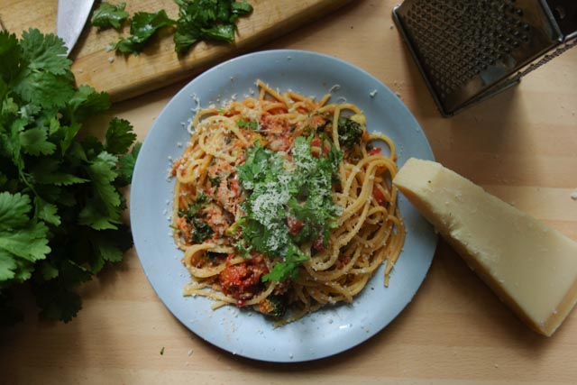

# Spaghetti with Tuna & Vegetables in Tomato Sauce

by @nobiot ☀️

## Stats

* Rating: Awesome
* Total Time: 30 min -ish

## Ingredients

* 1 can \(400 grams\) of whole tomato \(can be chopped or other form\)
* 1 handful of baby spinach
* 1 small onion, finely chopped
* 1 handful of continental parsley, finely chopped \(can be curly\)
* Grana Padano cheese, grated \(of course, Parmigiana is a fine option\)

